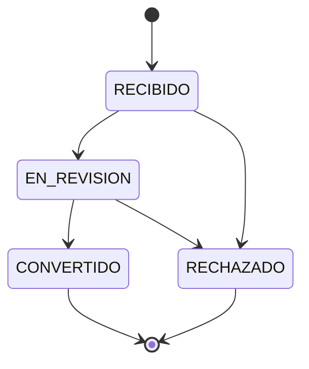
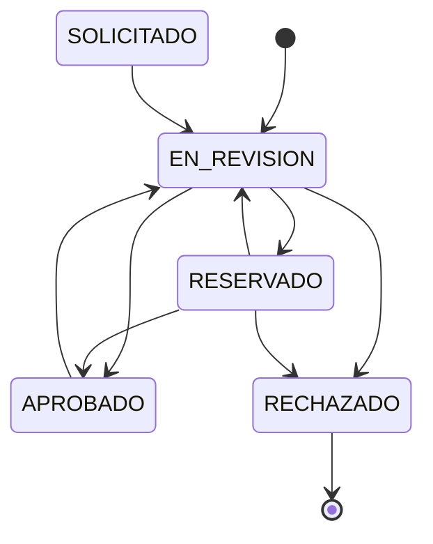

# Sistema de Gestión de Eventos — Universidad Nacional de Lanús

Aplicación web desarrollada como Trabajo Final Integrador para centralizar la administración de eventos de la Universidad Nacional de Lanús.

## Descripción del proyecto

La gestión de eventos se realizaba mediante planillas de cálculo, lo que dificultaba la coordinación entre áreas, la actualización de la información y la visualización de la agenda. Este esquema también podía generar superposiciones de fechas, horarios y espacios.

El sistema reúne solicitudes, eventos, calendarios y recursos en una única aplicación web. De esta manera facilita la coordinación de las áreas involucradas y el seguimiento de cada actividad. Fue desarrollado para la Universidad Nacional de Lanús como Trabajo Final Integrador de la Licenciatura en Sistemas.

## Alcance

El proyecto implementa un MVP orientado a centralizar la solicitud, planificación, validación y seguimiento de eventos extraacadémicos de la Universidad Nacional de Lanús. La solución contempla una interfaz pública para solicitantes y un entorno interno para las áreas responsables de la gestión.

## Funcionalidades principales

- Solicitud pública de eventos, con selección de un espacio registrado o ingreso de una ubicación libre.
- Seguimiento público de solicitudes mediante un código único.
- Revisión, rechazo y conversión de solicitudes en eventos por parte de usuarios internos.
- Creación, edición, consulta y baja lógica de eventos.
- Calendario público de eventos aprobados y calendario interno de gestión.
- Validación de disponibilidad de espacios, tiempos de preparación y conflictos de prioridad.
- Control de capacidad técnica y conformidad de las áreas de Ceremonial y Técnica.
- Gestión de estados de solicitudes y eventos.
- Administración de espacios y departamentos.
- Administración de usuarios y control de acceso según roles: `ADMIN_FULL`, `ADMIN_CEREMONIAL`, `ADMIN_TECNICA` y `USUARIO`.
- Eventos internos excluidos del calendario público.
- Comentarios internos, historial de estados y cambios relevantes, y notificaciones dentro del sistema.
- Notificaciones por correo ante el registro, los cambios de estado y la reprogramación de eventos.

## Funcionamiento general

### Solicitud pública

1. Una persona completa el formulario público.
2. Selecciona un espacio registrado o indica una ubicación libre.
3. El sistema valida los datos y, cuando corresponde, la disponibilidad del espacio.
4. Se genera un código único para consultar el estado de la solicitud.
5. Los usuarios internos pueden revisarla, rechazarla o convertirla en un evento.

### Gestión interna

Los usuarios internos, según su rol, pueden:

- Revisar solicitudes públicas.
- Crear y editar eventos.
- Consultar el panel de gestión y los calendarios.
- Cambiar estados y validar la disponibilidad de espacios.
- Registrar las conformidades de Ceremonial y Técnica.
- Agregar comentarios y consultar el historial del evento.

## Estados del sistema

### Solicitudes públicas

- `RECIBIDO`: la solicitud fue registrada correctamente.
- `EN_REVISION`: la solicitud está siendo analizada por un usuario interno.
- `CONVERTIDO`: la solicitud generó un evento.
- `RECHAZADO`: la solicitud fue rechazada.



### Eventos

- `SOLICITADO`: estado contemplado cuya única transición es `EN_REVISION`.
- `EN_REVISION`: el evento está siendo evaluado.
- `RESERVADO`: el evento queda reservado tras validar disponibilidad y, cuando corresponde, capacidad técnica.
- `APROBADO`: el evento cuenta con las conformidades necesarias.
- `RECHAZADO`: el evento no fue aprobado.



Las altas actuales se crean en `EN_REVISION`. La aprobación definitiva requiere las conformidades de las áreas de Ceremonial y Técnica.

### Conflictos

- `OPEN`: el conflicto de prioridad está pendiente y el evento desplazado queda marcado para reprogramación.
- `CLOSED`: el conflicto fue cerrado mediante una decisión.

Al cerrar un conflicto se registra una decisión `REBOOK_OTHER`, `KEEP_ORIGINAL` o `CANCELLED`.

## Tecnologías utilizadas

| Capa                           | Tecnologías                                                            |
| ------------------------------ | ---------------------------------------------------------------------- |
| Backend                        | Java 17, Spring Boot, Spring Data JPA y Maven Wrapper.11               |
| Frontend                       | React 19.2, TypeScript, Vite, Tailwind CSS, Zustand y FullCalendar     |
| Base de datos                  | MySQL 8.0 y Flyway                                                     |
| Contenedores y ejecución local | Docker, Docker Compose, Eclipse Temurin 17, Node.js 22 y MailHog 1.0.1 |

## Estructura del proyecto

```text
gestion-eventos-mvp/
├── backend/
│   ├── src/main/java/
│   ├── src/main/resources/
│   └── pom.xml
├── frontend/
│   ├── src/
│   └── package.json
├── docker-compose.yml
├── docker-compose.backend.yml
├── docker-compose.frontend.yml
├── .env.example
├── .env.local.example
└── README.md
```

- `backend/`: API REST con la lógica de negocio, persistencia y migraciones de base de datos.
- `frontend/`: interfaz web pública e interna desarrollada con React.
- `docker-compose.yml`: stack local completo con frontend, backend, MySQL y MailHog.
- `docker-compose.backend.yml` y `docker-compose.frontend.yml`: variantes para ejecutar cada parte por separado.
- `.env.example` y `.env.local.example`: referencias de configuración para Docker y para el backend local, respectivamente.

## Requisitos previos

### Ejecución con Docker

- Git.
- Docker Engine o Docker Desktop.
- Docker Compose v2, disponible mediante el comando `docker compose`.

### Ejecución manual

- JDK 17.
- Maven Wrapper incluido en `backend/`; no es necesario instalar Maven por separado.
- Node.js 22.12 o superior y npm.
- MySQL 8.0.
- Un servidor SMTP local, como MailHog, si se desea probar el envío real de correos.

## Instalación y ejecución con Docker

Clonar el repositorio:

```bash
git clone https://github.com/Miguelecf/gestion-eventos-mvp.git
cd gestion-eventos-mvp
```

Crear el archivo de configuración local:

```bash
cp .env.example .env
```

El ejemplo contiene valores pensados para desarrollo. Antes de iniciar, revisar como mínimo `MYSQL_ROOT_PASSWORD`, `SPRING_DATASOURCE_PASSWORD` —ambas deben ser coherentes con el usuario configurado— y `JWT_SECRET`. Si se modifica la base de datos, también deben mantenerse alineadas `MYSQL_DATABASE` y `SPRING_DATASOURCE_URL`. No se deben usar credenciales de desarrollo fuera de un entorno local.

Levantar el stack completo:

```bash
docker compose up --build
```

Detenerlo y remover los contenedores:

```bash
docker compose down
```

Con los puertos definidos en `.env.example`, los servicios quedan disponibles en:

- Frontend: <http://localhost:5173>
- Backend: <http://localhost:9090>
- Swagger UI: <http://localhost:9090/swagger-ui>
- MailHog: <http://localhost:8025>

MySQL se utiliza dentro de la red de Compose y no se publica en el host.

## Ejecución manual

### Backend

El perfil `local` es el predeterminado. Requiere MySQL en `localhost:3306`. Usar `.env.local.example` como referencia y cargar sus variables en la terminal o el IDE, ya que Spring Boot no lee ese archivo automáticamente. Para ejecutar sin un servidor SMTP, se puede habilitar `MAIL_MOCK_MODE=true`.

Desde la raíz del repositorio:

```bash
cd backend
./mvnw spring-boot:run
```

En Windows también puede utilizarse `.\mvnw.cmd spring-boot:run`.

### Frontend

En otra terminal, desde la raíz del repositorio:

```bash
cd frontend
cp .env.example .env
npm ci
npm run dev
```

El archivo `frontend/.env.example` configura la URL del backend local. Vite inicia el frontend en <http://localhost:5173>.

## Autores

- Elian Gonzalez
- Miguel Caraballo

Trabajo Final Integrador  
Licenciatura en Sistemas  
Universidad Nacional de Lanús
